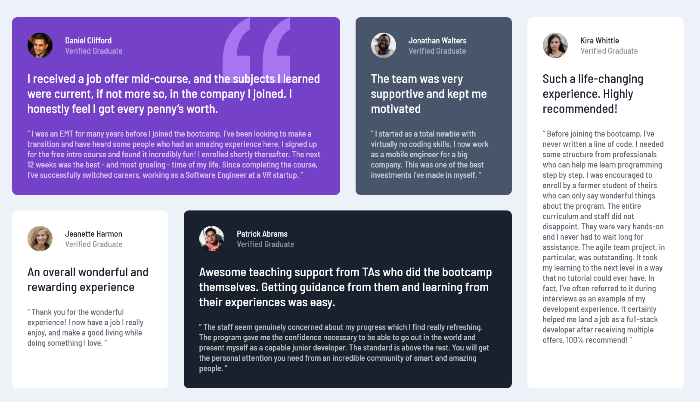

# Frontend Mentor - Testimonials grid section solution

This is a solution to the [Testimonials grid section challenge on Frontend Mentor](https://www.frontendmentor.io/challenges/testimonials-grid-section-Nnw6J7Un7). Frontend Mentor challenges help you improve your coding skills by building realistic projects.

## Table of contents

- [Overview](#overview)
  - [The challenge](#the-challenge)
  - [Screenshot](#screenshot)
  - [Links](#links)
- [My process](#my-process)
  - [Built with](#built-with)
  - [Useful resources](#useful-resources)
- [Author](#author)

## Overview

### The challenge

Users should be able to:

- View the optimal layout for the site depending on their device's screen size

### Screenshot

### Links

- Solution URL: [Testimonials Grid Section](https://tokkat.github.io/testimonials-grid-section/)

## My process

### Built with

- Mobile-first workflow
- Semantic HTML5 markup
- CSS custom properties
- CSS Grid

### Useful resources

- [CSS Grid Course by Wes Bos](https://cssgrid.io/) - This gave me a thorough intro into CSS grid.
- [CSS Grid Playlist by Kevin Powell](https://www.youtube.com/playlist?list=PL4-IK0AVhVjPv5tfS82UF_iQgFp4Bl998) - Another very useful resource when learning CSS grid. I also used this to quickly catch up on aspects I did not remember.

## Author

- Github - [@Tokkat](https://tokkat.github.io/)
- Frontend Mentor - [@Tokkat](https://www.frontendmentor.io/profile/tokkat)
